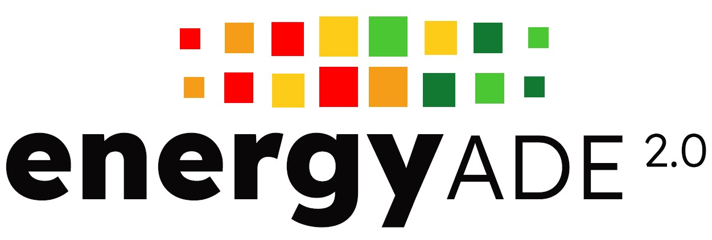
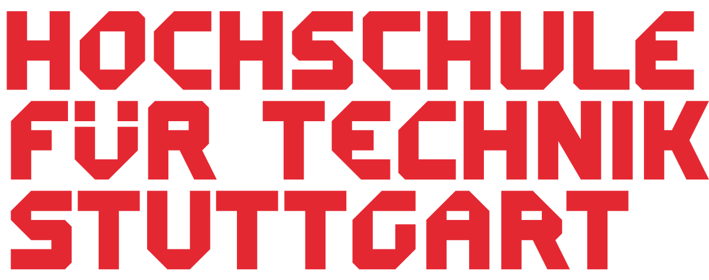
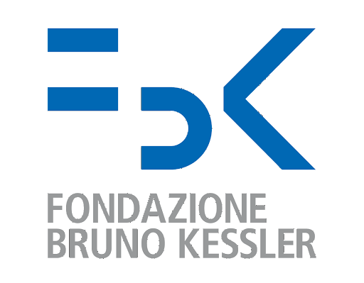
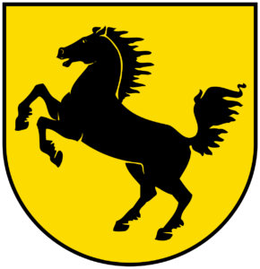
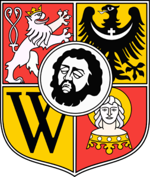

> [!NOTE]
> This GitHub repository will become public at the beginning of September 2025, shortly before the [3DGeoInfo/SDSC 2025 conference](https://www.csis.u-tokyo.ac.jp/3d_geoinfo_sdsc_2025/overview.html) in Japan.
> Till then we will keep updating and improving it before the "great opening" 🎆

      

<!--  -->

# Introduction

The **CityGML Energy Application Domain Extension 2.0** (or, in short: Energy ADE 2.0) offers an open and standardised data model to facilitate multi-scale Urban Energy Modelling applications.

The current version is based on and builds upon the first version of the [Energy ADE](https://www.citygmlwiki.org/index.php/CityGML_Energy_ADE), released in 2018, which has been already used in several national and international projects, mainly focusing on the simulation and computation of the building energy performance based on the integration of semantic 3D city models and other sources of information.

The technological innovations (e.g. the release of CityGML 3.0 in 2021) and the experiences and feedback collected since its release have contributed to forge several new ideas to improve and update the Energy ADE. Since 2024, work has been going on to harmonise and implement such ideas, towards a so-called Energy ADE 2.0.

The Energy ADE 2.0 is currently based on and extends [CityGML 2.0](https://portal.ogc.org/files/?artifact_id=47842), but its development already keeps in consideration its future porting to [CityGML 3.0](https://docs.ogc.org/is/20-010/20-010.html)

# The Energy ADE 2.0 in a nutshell

The Energy ADE 2.0 has a modular structure:
- The **Core module** defines additional attributes for the CityGML core::_CityObject and bldg::_AbstractBuilding classes. It also provides new abstract base classes for the other modules;
- The **Building physics module** defines additional attributes for the CityGML bldg::_BoundarySurface and bldg::_Opening classes. Additionally, it defines new classes to model the thermal hull of a building;
- The **Occupancy module** defines classes to model different usage zones and their occupants;
- The **Devices module** provides classes to model different types of energy-related devices that transform or store energy (e.g. solar collectors, storage devices, etc.);
- The **Layered construction module** enables the modelling of the composition of construction surfaces through different layers and their physical properties;
- The **Resources module** allows to model resources (energy, water, food, etc.) that an urban object may need, produce or store;
- The **Urban function areas module** allows to define spatial entities that allow to aggregate values;
- The **WeatherStation module** contains a class to model weather stations;
- The **Schedules module** includes different types of schedules;
- The **TimeSeries module** contains classes for time series;
- The **CodeLists, Enumerations and DataTypes** modules contain support classes that are needed by all other modules.

Please refer to the [documentation](https://github.com/tudelft3d/Energy_ADE_2.0/blob/main/documentation/Energy_ADE_2.0_Specifications.pdf) for more details, as well as a detailed description of the changes between the Energy ADE 1.0 and the Energy ADE 2.0.

Besides the conceptual model, available as [UML diagrams](https://github.com/tudelft3d/Energy_ADE_2.0/blob/main/documentation/Energy_ADE_2.0_UML_diagrams.pdf) (and the accompanying specifications), additional resources are available, such as:

- **DDL scripts** to set up the 3D City Database automatically using the ADE Manager
- An **FME Workbench** that allows to import CityGML + Energy ADE 2.0 data into the 3D City Database
- **Test datasets** that focus on different aspects/modules of the Energy ADE 2.0
- A **set of modelling rules and suggestions** explaining how to use certain classes of the Energy ADE (please refer to the documentation)
- Additionally, **Java-based libraries** are currently being developed to add support to the [citygml4j](https://github.com/citygml4j/citygml4j) APIs and to the CityGML [3D City Database Importer/Exporter](https://github.com/3dcitydb/importer-exporter).

# Further resources

- Are you struggling to read and understand UML? Download this **[UML crash course](https://3d.bk.tudelft.nl/gagugiaro/tutorials/pdf/UML_in_a_nuthshell.pdf)** providing you with the basics to "survive" 😉
- Looking for a quick install guide to set up the 3DCityDB? Check out the **Quick install guides** for [Windows](https://github.com/tudelft3d/3DCityDB-Tools-for-QGIS/blob/master/manuals/3dcitydb_install/3DCityDB_Suite_QuickInstall_Windows.pdf), [Ubuntu Linux](https://github.com/tudelft3d/3DCityDB-Tools-for-QGIS/blob/master/manuals/3dcitydb_install/3DCityDB_Suite_QuickInstall_Ubuntu.pdf) and [macOS](https://github.com/tudelft3d/3DCityDB-Tools-for-QGIS/blob/master/manuals/3dcitydb_install/3DCityDB_Suite_QuickInstall_macOS.pdf)!
- No idea on how to use FME with CityGML? Have a look at these **introductory tutorials** on [FME](https://3d.bk.tudelft.nl/gagugiaro/tutorials/pdf/FME_Form_for_beginners.pdf) and [Reading and Writing CityGML data](https://3d.bk.tudelft.nl/gagugiaro/tutorials/pdf/FME_CityGML.pdf) 💪

# Contact person:

- [Giorgio Agugiaro](mailto:g.agugiaro@tudelft.nl) @ TU Delft

# Main developers and contributors 

- Giorgio Agugiaro (TU Delft, The Netherlands)
- Volker Coors (HFT Stuttgart, Germany)
- Jérôme Kämpf (Idiap, Switzerland)
- Thomas Kolbe (TU Munich, Germany)
- Camilo León-Sánchez (TU Delft, The Netherlands)
- Rushikesh Padsala (HFT Stuttgart, Germany)
- Simon, Raming (RWTH Aachen, Germany) 
- Maxim, Shamovich (RWTH Aachen, Germany)
- Zhihang Yao (HFT Stuttgart, Germany)

<table align="center">
  <tr>
    <td align="center" valign="middle"></td>
    <td align="center" valign="middle"></td>
    <td align="center" valign="middle"></td>
    <td align="center" valign="middle"></td>
    <td align="center" valign="middle"></td>
  </tr>
</table>

# Early testers and technology enthusiasts

- University of Antwerp, Belgium
- IREC - Institut de Recerca en Energia de Catalunya, Barlellona, Spain
- Infosolutions Sp. z o.o., Poland
- Wroclaw University of Environmental and Life Sciences, Poland
- FBK - Fondazione Bruno Kessler, Trento, Italy
- AIT - Austrian Institute of Technology, Austria
- Municipality of Rotterdam, Netherlands
- Municipality of Stuttgart, Germany
- Municipality of Wien, Austria
- Municipality of Wrozlaw, Poland

<table align="center">
  <tr>
    <td align="center" valign="middle"></td>
    <td align="center" valign="middle"></td>
    <td align="center" valign="middle"></td>
    <td align="center" valign="middle"></td>
    <td align="center" valign="middle"></td>
    <td align="center" valign="middle"></td>
  </tr>
  <tr>
    <td align="center" valign="middle"></td>
    <td align="center" valign="middle"></td>
    <td align="center" valign="middle"></td>
    <td align="center" valign="middle"></td>
  </tr>
</table>

# License

The software resources available on this repository adopt the [Apache License 2.0](https://www.apache.org/licenses/LICENSE-2.0). 
The documentation and the UML diagrams are released under the Creative Commons License [CC BY-NC-SA 4.0](https://github.com/user-attachments/assets/e124ad94-256d-4a5e-a42c-8b52b2ea9728)

# Citation

If you use the Energy ADE 2.0 in scientific work, please cite one of our papers:

<!--
- Agugiaro, G., Padsala, R., 2025 
**A proposal to update and enhance the CityGML Energy Application Domain Extension**. 
ISPRS Ann. Photogramm. Remote Sens. Spatial Inf. Sci., Vol xxxx 
Link to [open-access PDF](...). 

- Gao, W., León-Sánchez, C., Agugiaro, G., 2025  
**Data-driven energy simulations to evaluate positive energy district potential in Rotterdam**. 
ISPRS Ann. Photogramm. Remote Sens. Spatial Inf. Sci., Vol xxxx, 2025 
Link to [open-access PDF](...). 

- Padsala, R., ...., 2025  
**xxx**. 
ISPRS Ann. Photogramm. Remote Sens. Spatial Inf. Sci., Vol xxxx, 2025 
Link to [open-access PDF](...). 
-->

- Gebetsroither-Geringer, E., Padsala, R., Hainoun, A., Agugiaro, G., Biernat, S., Reber, A., Smetschka, B., Gao, W., Horak, D., Falay, B., Coors, V., 2025 
**A participatory planning framework using urban digital twins supporting the co-creation of flexible, Positive Energy Districts**. 
(Schrenk, M., Popovich, V.V., Zeile, P., Elisei, P., Beyer, C., Ryser, J., Trattnig, U., eds) 
REAL CORP 2025 Proceedings/Tagungsband, pp. 65-76. Graz, Austria, 14-16 April 2025. ISBN 978-3-9504945-4-9. 
Link to [open-access PDF](https://archive.corp.at/cdrom2025/papers2025/CORP2025_115.pdf). 

- Bachert, C., León-Sánchez, C., Kutzner, T., Agugiaro, G., 2024 
**Mapping the CityGML Energy ADE to CityGML 3.0 using a model-driven approach**. 
ISPRS Int. Journal of Geo-Information, MDPI, 13(4) 
Link to [open-access PDF](https://www.mdpi.com/2220-9964/13/4/121/pdf?version=1712227125). 

# Funding

Development of the Energy ADE 2.0 has started in spring 2024 within the European [DigiTwins4PEDs](https://digitwins4peds.eu/) project. The project is funded by the European Commission under the Horizon Europe Partnership scheme. The [DUT Call 2022](https://dutpartnership.eu/funding-opportunities/dut_call_2022/) also contributes to the Urban Transition Mission of Mission Innovation as part of the MICall 2022 initiative.

In addition to the DigiTwins4PEDs consortium members, several other partners have joined on a volunteer basis as enthusiastic contributors, early testers or technology enthusiasts.
